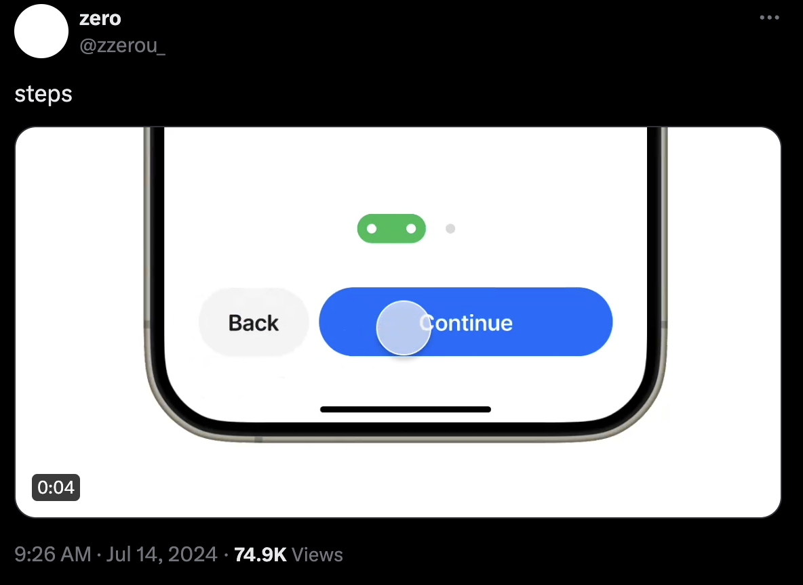
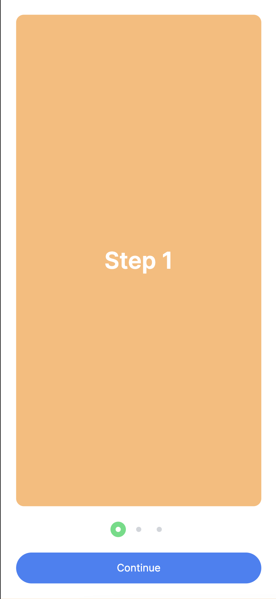

## Steps example

Small project created with NextJS ReactJS and Tailwind to replicate this [tweet](https://twitter.com/zzerou_/status/1812509007648846300) created with figma.

<center>

</center>

## Preview

[uiux-steps.vercel.app](https://uiux-steps.vercel.app/)

## Getting Started

```bash
pnm i
pnpm dev
```

Open [http://localhost:3000](http://localhost:3000) with your browser to see the result.

<center>

</center>
